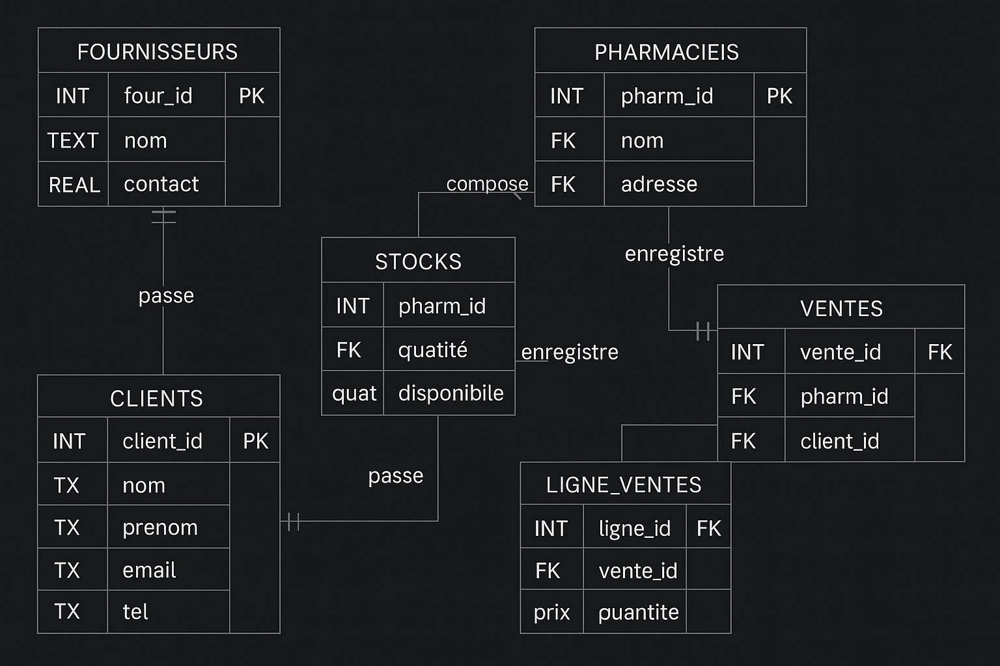

# 💊 Pharma Sales & Inventory Management (SQL Project)

Ce projet est un système de gestion des **ventes** et des **stocks** dans une **industrie pharmaceutique**. Il a été développé dans le cadre d’un exercice pratique SQL.Les données de la base sont fictives et ont été générées par une intelligence artificielle.

## 🗃️ Objectif

L’objectif principal est de :
- Constituer et maintenir un catalogue de médicaments (nom, dosage, forme, prix unitaire).
- Suivre les pharmacies clientes, les fournisseurs et les clients finaux.
- Enregistrer les ventes et détailler chaque commande (lignes de vente).
- Gérer les niveaux de stock, avec contrôle des seuils d’alerte pour réapprovisionnement.

Le projet « Pharma Sales & Inventory Management » répond à différents besoin au sein d’une industrie pharmaceutique tels traiter les ventes (création de commandes, calcul des totaux), gérer les stocks par médicament et par pharmacie (suivi des quantités disponibles, seuils d’alerte pour réapprovisionnement) et enregistrer et suivre les pharmacies clientes, les fournisseurs de médicament et les clients finaux.

## 📁 Structure du projet

- pharma.db : base de données principale (SQLite)

- SQL/ - contient tous les fichiers SQL à exécuter par étapes :

  1.SQL → création des tables (schema de base)

  2.SQL → médicaments

  3.SQL → fournisseurs

  4.SQL → pharmacies

  5.SQL → stocks
  
  6.SQL → clients

  7.SQL → ventes

  8.SQL → détail des ventes (lignes)

- README.md : fichier d'explication du projet, de son but et de son exécution

## Modèle Conceptuel : Entités et Relations



## Choix de conception

- Clé composite dans STOCKS : le couple (pharm_id, med_id) garantit l’unicité d’un médicament dans une pharmacie et prévient les doublons.

- Intégrité référentielle : toutes les relations sont sécurisées par des clés étrangères, ce qui bloque la suppression de données encore référencées.

- Historique des ventes : la table VENTES séparée de LIGNE_VENTES permet de conserver à la fois l’en‑tête (date, client, pharmacie) et le détail de chaque article vendu.

- Extensibilité : le modèle peut facilement accueillir de nouvelles entités (retours, paiements, catégories de médicaments, entrepôts) sans refonte majeure.

## Limitations


## Exercice / Requetes SQL = "PharmoMEd"


# Contexte : 
Vous êtes data analyst chez PharmoFacto, un laboratoire qui vend ses médicaments via un réseau de pharmacies partenaires.
Votre mission : extraire des indicateurs clés pour le reporting mensuel et pour répondre aux questions de la direction logistique / commerciale.

# Question à résoudre : 

1. Total de ventes par pharmacie
   
```
SELECT pharm_id, COUNT(*) FROM ventes GROUP BY pharm_id;
```

2. Médicaments les plus vendus

```
SELECT med_id, SUM(quantite) as total_vendu
FROM ligne_ventes
GROUP BY med_id
ORDER BY total_vendu DESC
LIMIT 5;
```

3. Total de ventes par pharmacie

```
SELECT pharm_id, COUNT(*) FROM ventes GROUP BY pharm_id;
```

4. Valeur de stock (en €) par pharmacie

```
SELECT p.pharm_id, p.nom, ROUND(SUM(s.quantite_disponible * m.prix_unitaire),2) AS valeur_stock FROM stocks s JOIN medicaments m USING (med_id) JOIN pharmacies p USING (pharm_id) GROUP BY p.pharm_id;
```

5.


## Perspectives d'amélioration 

Cette base peut être enrichie avec :

- Un historique des prix des médicaments (variations datées)

- Des données d’approvisionnement : fournisseur, coût, délai de livraison

- La traçabilité des mouvements de stock (entrées, sorties, inventaires)


```
## ⚙️ Installation & Lancement

1. **Cloner le projet :**

```bash
git clone https://github.com/ton-utilisateur/SQL_Pharma.git
cd SQL_Pharma
```


## Auteurs

- Ali BOUGUERRA
- Nawel ARIF
- Thi Hong Nhung Nguyen 


